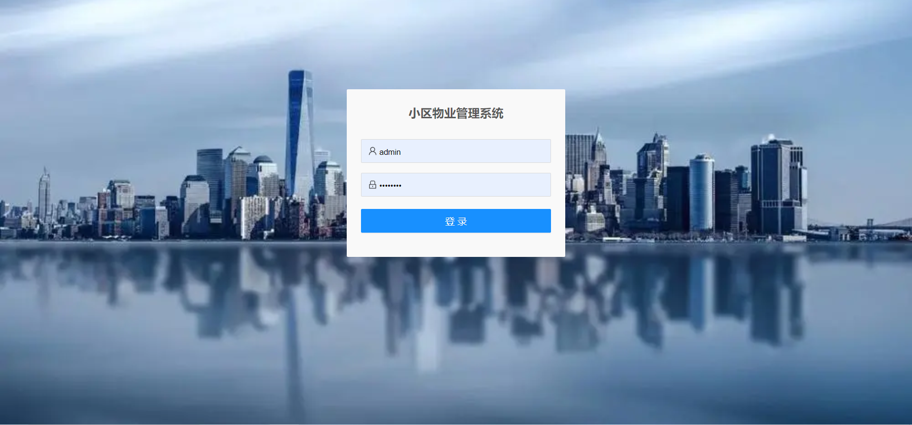
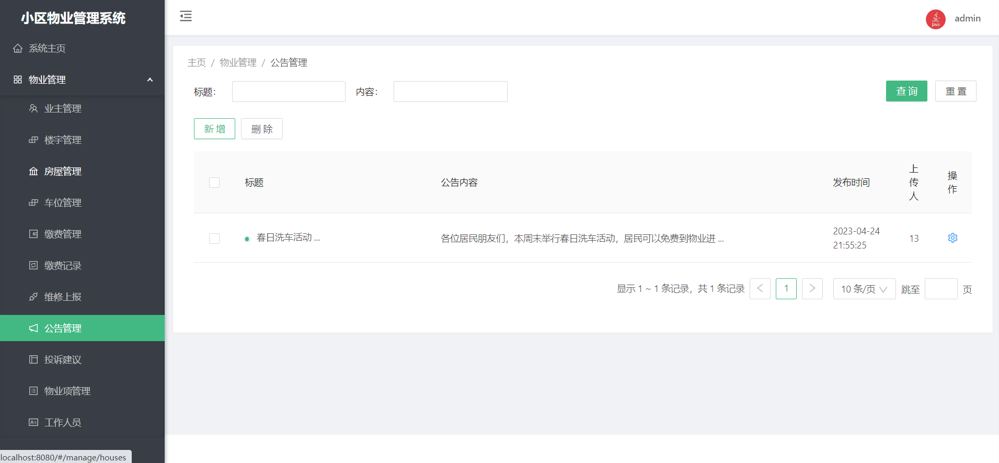

# 小区物业管理系统 

##（源代码+12000字文档+ppt）

## 项目简介
小区物业管理系统是一套基于SpringBoot的前后端分离的管理系统，分为物业管理人员和业主两个角色。 
物业管理人员可以对业主、楼宇、房屋、车位进行管理，处理业主的维修和投诉工单，发送通知公告，还可以抄表入户，对业主下达缴费通知单。 
业主可以查看自己的房屋和车位信息，缴纳物业费用，并提交报修工单以及投诉信息。 
前端使用Vue框架，后端使用SpringBoot框架，数据库使用的是Mysql。 
本系统功能完善，涉及的技术比较广，难度适中，都是市面上主流的技术，非常适合作为设计项目或开发学习。 

## 功能介绍

## 技术学习

如果你在安装过程中，或对项目有疑问，可以关注本人公众号获取本人联系方式进行咨询。 
公众号内还有更多项目供你选择。 

## 技术服务

## 技术栈

| 工具及技术             | 版本    |
| ---------------------- | ------- |
| idea                   |         |
| JDK                    | 1.8     |
| SpringBoot             | 2.2.1   |
| MyBatis                | 1.3.2   |
| JWT                    | 3.4     |
| Vue                    | 2.0     |
| ElementUI              | 2.0     |
| MySQL                  | 5.7     |
| Node                   | v16.16.0|

## 系统图片

#### 1.登录页
 
#### 2.首页
 
#### 3.业主管理
 
#### 4.楼宇管理
 
#### 5.缴费管理
 
#### 6.抄表入户
 
#### 7.维修上报
 
#### 8.公告管理
 
#### 9.业主缴费
 
#### 10.打印缴费凭证
 
